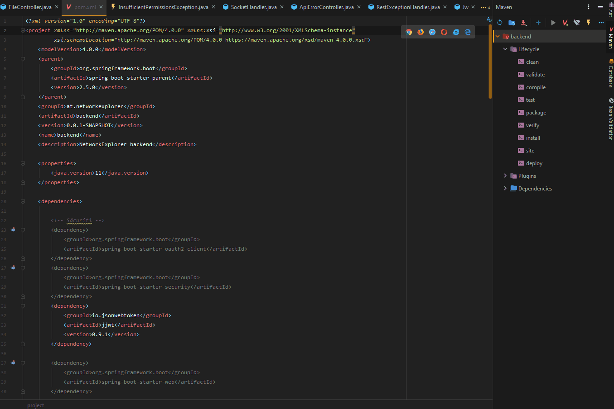
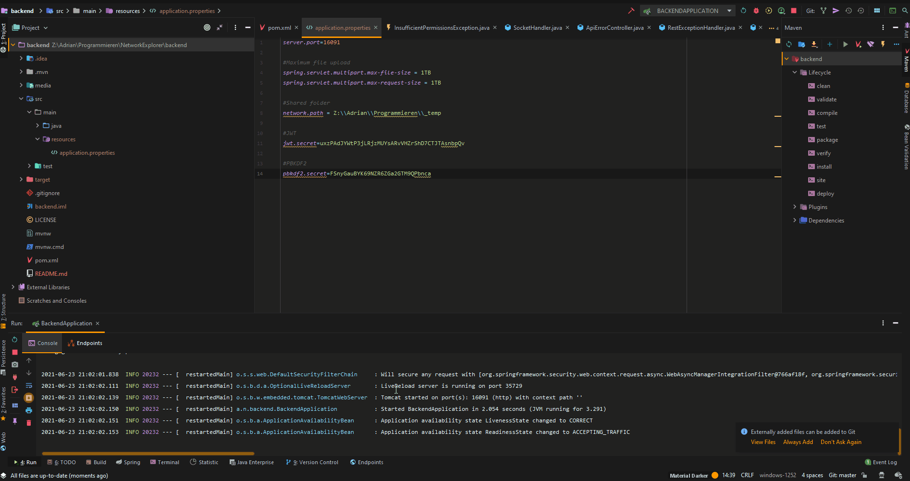

<p align="center">
  
</p>

<h1 align="center">NetworkExplorer - backend</h1>

The backend side of NetworkExplorer - a project that arose out of our Software Engineering subject. Made with Spring Boot

## Table of Contents

- [Table of Contents](#table-of-contents)
- [Requirements](#requirements)
- [Building the JAR](#building-the-jar)
- [Development Setup](#development-setup)
	- [Installation](#installation)
		- [IntelliJ](#intellij)
		- [CLI](#cli)
	- [Configuration](#configuration)
		- [Example Configuration](#example-configuration)
	- [First Start](#first-start)
	- [Usage](#usage)
		- [Testing](#testing)
		- [Deleting User Data](#deleting-user-data)

## Requirements

- Maven
- JDK 13+

## Building the JAR

It is as easy as running `./mvnw install clean` (Linux/MacOS) or `.\mvnw install clean` (Windows). The output JAR will be in the `target` directory. You can start the spring application with this command: `java -jar <path-to-jar> at.networkexplorer.backend.BackendApplication`. Your `application.properties` needs to be in the same directiory where you execute the command. An example configuration can be found in the [Configuration](#configuration) section.

## Development Setup

The setup couldn't be more simple. Just download this repository and open it in `IntelliJ`.

### Installation

For the installation, you first have to resolve all dependencies and then add a configuration file.

#### IntelliJ

When using IntelliJ, you only have to open the project, double click on the `pom.xml` and import everything.


#### CLI

On the CLI, you simply have to execute `./mvnw install` (Linux/MacOS) or `.\mvnw install` (Windows) in the root folder.

### Configuration

For this part, a `resources` folder in the `src/main/` directory is needed. In the `resources` subdirectory, a `application.properties` needs to be created. -- This can also be done with a compiled `.jar` by putting the configuration file in the same folder as the `.jar`.

Copy and Paste the following into the `application.properties`:

```properties
server.port=16091

#Maximum file upload
spring.servlet.multipart.max-file-size = <MAX_SIZE>
spring.servlet.multipart.max-request-size = <MAX_SIZE>

#Shared folder
network.path = <SHARED_FOLDER>

#JWT
jwt.secret=<JWT_SECRET>

#PBKDF2
pbkdf2.secret=<PBKDF2_SECRET>
```

... where ...

- `MAX_SIZE` is the maximum allowed file size to be uploaded,
- `SHARED_FOLDER` is the absolute path (on your harddrive) that you want to share, (with Windows: make sure to use double <u>backslash</u>!)
- `*_SECRET` are the SECRET keys for JWT generation and password hashing

#### Example Configuration

```properties
server.port=16091

#Maximum file upload
spring.servlet.multipart.max-file-size = 1TB
spring.servlet.multipart.max-request-size = 1TB

#Shared folder
network.path = Z:\\Adrian\\Programmieren\\shared

#JWT
jwt.secret=uxzPAdJYWtP3jLRjzMUYsARvVHZrShD7CTJTAsnbpQv

#PBKDF2
pbkdf2.secret=FSnyGauBYK69NZR6ZGa2GTM9QPbnca
```

### First Start

The first start of the server requires attention, because you will have to note down the admin password - it can be changed later.



### Usage

You are done with the backend part now. You may move on to the frontend.

#### Testing

You can test whether the server is started by opening [localhost:16091/api/v1/ping](http://localhost:16091/api/v1/ping)

#### Deleting User Data

If you forgot to write down the admin password (or forgot it)... no problem! You can easily reset the whole user data.

1. Navigate to the root folder of the project and delete `nwexp.json`
2. Restart the Server
3. Note down the new admin password
